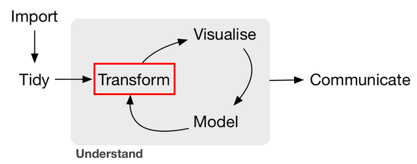

## Transformación de datos

```{r setup04, include=FALSE}
knitr::opts_chunk$set(echo = T, error = F, message = F, warning = F, results='markup')
```

Esta sección resume algunas de las funciones existentes para **transformar** 
datos en `R`. En particular, se revisan las transformaciones más comunes que
se realizan sobre datos. En esta sección, se revisan las acciones 
implementadas en el paquete `dplyr` [@dplyr]. 
En la figura [5.3](#fig:ciclo3) podemos ver la etapa del
análisis de datos correspondiente.

```{r ciclo3, out.width='75%', fig.show='hold', fig.align = 'center', fig.cap='Transformación de datos [@grolemund2016r, Introducción].', echo = FALSE, results='hold'}

```

Existen muchas maneras de transformar los datos y una gran cantidad de paquetes
que implementan distintas funciones útiles para realizar esta tarea. En particular,
resaltamos `dplyr` y `data.table`. En esta sección se ejemplifican todas
las funciones que permiten hacer trabajo con datos que están implementadas en 
`dplyr`^[Para iniciar en `data.table` se recomienda ver @datatabletutorial así como las viñetas del paquete @datatable.] y en `tidyr` [@tidyr].

### Tareas comunes en la manipulación de datos

Las funciones implementadas en este paquete están diseñadas para facilitar la 
transformación de datos. En general, la transformación de datos implica definir
qué se hará con ellos, escribir un programa que realice esa tarea y ejecutarlo [@dplyr, viñeta de introducción].

`dplyr` y `tidyr` simplifican estos pasos al proveer de opciones limitadas consideradas como
las tareas más comunes en la transformación de datos. Además, proveen de verbos simples que
corresponden a funciones en `R` y que mapean directamente a estas *tareas más comunes* (ver Cuadro [5.1](#tab:accionescomunes)).

```{r accionescomunes, echo=FALSE, results='hold'}
dfTab <- data.frame(
  a <- c("Extracción de **subconjuntos de observaciones**.",
         "Extracción de **subconjuntos de variables**.",
         "Creación de **resumenes de datos**.",
         "Creación de **nuevas variables**.",
         "**Combinación** de conjuntos de datos.",
         "**Agrupar** datos.",
         "**Reorganizar** datos (*reshape data*)."),
  
  b <- c(paste("<span>&#8226;</span> `filter`: seleccionamos filas de acuerdo a los valores de las variables<br>",
         "<span>&#8226;</span>`distinct`: elimina renglones duplicados<br>",
         "<span>&#8226;</span>`sample_frac`: selecciona aleatoriamente una fracción de filas<br>",
         "<span>&#8226;</span>`sample_n`: selecciona aleatoriamente $n$ filas<br>",
         "<span>&#8226;</span>`slice`: selecciona filas por posición<br>",
         "<span>&#8226;</span>`top_n`: selecciona y ordena según una variable $n$ entradas", sep=""),
         "<span>&#8226;</span>`select`: seleccionamos un subconjunto de las columnas utilizando los nombres de las variables",
         paste("<span>&#8226;</span>`summarise`: resume los datos en un valor único<br>",
               "<span>&#8226;</span>`summarise_each`: aplica una función de resumen a cada columna<br>",
               "<span>&#8226;</span>`count`: cuenta el número de filas con cada valor única de una variable", sep=""),
         paste("<span>&#8226;</span>`mutate`: genera nuevas variables a partir de las variables originales<br>",
               " <span>&#8226;</span>`mutate_each`: aplica una función ventana a cada columna<br>",
               "<span>&#8226;</span>`transmute`: genera una o más nuevas columnas eliminando las columnas originales", sep=""),
         paste("<span>&#8226;</span>`left_join`: realiza un join conservando todas las observaciones de la primera tabla especificada<br>",
               "<span>&#8226;</span>`right_join`: realiza un join conservando todas las observaciones de la segunda tabla especificada<br>",
               "<span>&#8226;</span>`inner_join`: realiza un join conservando todas las observaciones que están en ambas tablas<br>",
               "<span>&#8226;</span>`full_join`: realiza un join conservando todas las observaciones y valores de ambas tablas<br>",
               "<span>&#8226;</span>`semi_join`: conserva todas las observaciones de la primera tabla que están en la segunda tabla<br>",
               "<span>&#8226;</span>`anti_join`: conserva todas las observaciones de la primera tabla que no están en la segunda tabla<br>",
               "<span>&#8226;</span>`intersect`: conserva observaciones que están tanto en la primera tabla como en la segunda<br>",
               "<span>&#8226;</span>`union`: conserva observaciones que están en cualesquier tabla<br>",
               "<span>&#8226;</span>`setdiff`: conserva observaciones de la primera tabla que no están en la segunda<br>",
               "<span>&#8226;</span>`bind_rows`: une las filas de la segunda tabla a las de la primera<br>",
               "<span>&#8226;</span>`bind_cols`: une las columnas de la segunda tabla a las de la primera", sep=""),
         paste("<span>&#8226;</span>`group_by`: agrupa los datos según una o más variables<br>",
               "<span>&#8226;</span>`ungroup`: elimina los grupos en un data frame", sep=""),
         paste("<span>&#8226;</span>`data_frame`: combina vectores en un dataframe<br>",
               "<span>&#8226;</span>`arrange`: Ordena las filas según una o más variables<br>",
               "<span>&#8226;</span>`rename`: renombra columnas de un dataframe", sep=""))
)
colnames(dfTab) <- c("Acción","Verbos")

knitr::kable(
  dfTab, booktabs = TRUE,
  caption = 'Acciones y verbos comunes en la manipulación de datos [@datawrangling].'
)
```

Dentro de `tidyr` hay más verbos útiles para reorganizar datos que se verán en la sección \ref{datos-limpios}
junto con los *criterios de datos limpios* que proporcionan un sustento para
la conceptualización de la manipulación de datos eficiente en `R`.

Todos estos verbos funcionan de la misma manera (tienen la misma estructura):

- El primer argumento de la función es un *data.frame*
- Los argumentos subsecuentes indican qué es lo que se debe hacer a ese *data.frame*
- Siempre regresa un *data.frame*

A continuación, se ejemplifica el uso de los distintos verbos de la tabla [5.2](#tab:accionescomunes).
Para esto, utilizaremos los siguientes
conjuntos de datos de muestra, todos disponibles en el paquete `nycflights13` [@flights]. Se leerán desde archivo de texto plano para ejemplificar algunos elementos de la limpieza.


```{r, echo=FALSE, warning=FALSE, message=FALSE, error=FALSE}
library(dplyr)
library(readr)
```

Nota como utilizamos la función del paquete `readr` `read_csv`. Esta es una 
nueva implementación de `read.csv` pero mucho mas rápida.

```{r}
flights <- read_csv("data/flights.csv")
flights
planes <- read_csv("data/planes.csv")
planes
airports <- read_csv("data/airports.csv")
airports
```

### Extracción de subconjuntos de observaciones

#### filter

Ya habíamos visto muchas maneras de extraer datos específicos de una base de 
datos de acuerdo a condiciones lógicas impuestas en los valores de las filas
de columnas especificas. `filter` nos permite poner tantas condiciones como 
queramos de manera muy fácil y entendible por cualquiera que lea nuestro código.

Busquemos, por ejemplo, todos los vuelos hacia SFO u OAK

```{r}
filter(flights, dest == "SFO" | dest == "OAK")
```

Los vuelos con retraso mayor a 5 horas

```{r}
filter(flights, arr_delay > 5)
```

Podemos juntar las preguntas: vuelos con retraso mayor a 5 horas con destino a 
SFO o OAK

```{r}
filter(flights, dest == "SFO" | dest == "OAK", arr_delay > 5)
```

#### distinct

Para eliminar duplicados, usamos la función `distinct` 

```{r}
flights.dup <- bind_rows(flights, flights)
dim(flights.dup)
dim(distinct(flights.dup))
rm(flights.dup)
```

#### sample_n, sample_frac, slice

En ocasiones necesitamos extraer subconjuntos aleatorios de los datos, para ello
podemos especificar el número de renglones que necesitamos (usando `sample_n`),
el porcentaje de datos que deseamos (usando `sample_frac`) o las posiciones
específicas de los datos que queremos (usando `slice`).

```{r}
set.seed(1099) 
# extraemos 10 datos en forma aleatoria
sample_n(flights, size = 10)
# Extraemos el 1% de los datos de flights
sample_frac(flights, size = 0.01)
# extraemos las posiciones 100 a 110
slice(flights, 100:110)
```

#### top_n

Podemos obtener los 5 vuelos con mayor retraso de salida:

```{r}
top_n(flights, 5, dep_delay)
```

O con el menor retraso de salida:

```{r}
top_n(flights, 5, desc(dep_delay))
```

### Extracción de subconjuntos de variables (*select*)

Podemos ahora, mas fácilmente, quedarnos con únicamente ciertas variables. 
`select` esta implementado de tal manera que funciona *nombrando* las variables
que se quieren utilizar.

```{r}
select(flights, flight, dest)
```

También podemos especificar que queremos todas las variables *menos* algunas.

```{r}
select(flights, -date, -hour, -minute, -dep, -arr, -carrier, -flight)
```

Podemos pedir las variables que empiezan con algún caracter.

```{r}
select(flights, starts_with("d"))
```

O las que contienen algún patrón

```{r}
select(flights, contains("dep"))
```

```{block, type='ejercicio'}
**Ejercicios**


1. Revisa la ayuda de select con `?select`.
2. Juega con la función `starts_with()`. ¿Qué variables empiezan con "de"?
3. Juega con la función `ends_with()`. ¿Qué variables terminan con "delay"?
4. Utiliza la base de datos `iris` como en el ejemplo de la ayuda.
5. ¿Qué hace la función `contains()`?
6. ¿Cómo es diferente de `matches()`?
7. ¿Cómo obtienes todas las variables *menos* Petal.Width?
```


### Creación de resumenes de datos

Las funciones `summarise`, `summarise_each` y `count` permiten realizar 
resumenes para ciertas variables existentes o nuevas en los datos.

#### summarise 

Ahora, si queremos saber el promedio de velocidad de los vuelos 
podemos calcularlo fácilmente con `summarise`.

```{r}
flights$velocidad <- flights$dist/flights$time

summarise(flights, vel_prom = mean(velocidad, na.rm = T))
```

```{block, type='curiosidad'}
**Funciones resumen**

Pueden utilizarse junto con summarise cualesquiera función en `R` 
(por ejemplo: min, max, mean, median, var, sd) que
realice agregaciones de vectores. Sin embargo, el paquete `dplyr` implementa
varias funciones útiles adicionales como [@datawrangling]: 


* `first`: extrae el primer valor de un vector
* `last`: extrae el último valor de un vector
* `n`: cuenta el número de valores en un vector
* `n_distinct` cuenta el número de valores único en un vector
```

#### summarise_each

Podemos especificar una función a aplicar a variables específicas en un
dataframe. Por ejemplo, extraer la media para las variables: date, dep_delay,
arr_delay, time y dist.

```{r}
summarise_each(flights, funs(mean), date, dep_delay, arr_delay, time, dist)
```

Debido a que existen valores perdidos en variables como retraso de salida (*dep_delay*)
y retrasos de llegada (*arr_delay*), debemos especificar la opción para no utilizar los NAs en la función.

```{r}
summarise_each(flights, funs(mean(., na.rm = T)), date, dep_delay
               , arr_delay, time, dist)

# opcion 2
mean_na <- function(x){
  mean(x, na.rm = T)
}
summarise_each(flights, funs(mean_na), date, dep_delay, arr_delay, time, dist)
```

#### count

Podemos contar los valores únicos en variables categóricas, por ejemplo, contar
el número de vuelos por aerolínea:

```{r}
dplyr::count(flights, carrier, sort = T)
```

### Creación de nuevas variables

#### mutate y transmute

Muchas veces lo que se desea es generar nuevas variables utilizando funciones sobre
las variables de la tabla.

Por ejemplo, queremos saber cual fue el vuelo mas rápido. Para esto queremos
calcular la velocidad promedio del vuelo.

```{r}
select(arrange(mutate(flights, velocidad = dist/time), desc(velocidad)),
       flight, dest, velocidad)
```

Esta manera de transformar a los datos (utilizando varios de los verbos) es 
confusa y difícil de leer. Es más sencillo utilizar el operador pipe^[Para una explicación más detallada de la importancia de este operador en la simplificación de código, ver la nota del autor del paquete Stefan Milton en @simplermagrittr y la viñeta `magrittr` dentro del paquete.] de `R` implementado
en el paquete `magrittr`, es decir, `%>%` [@magrittr].

```{r}
flights2 <- mutate(flights, velocidad = dist/time) %>%
              arrange(., desc(velocidad)) %>%
              select(., flight, dest, velocidad)
flights2
```

La lectura es mucho mas sencilla de esta forma pues se lee de manera secuencial
las transformaciones que se están realizando a los datos:

1. Agrego la columna de velocidad a la base de datos de `flights`, luego (operador pipe)
2. Ordeno los vuelos en forma descendiente según su velocidad, luego
3. Selecciono las variables de vuelo, destino y velocidad.

Que el código sea entendible no es importante únicamente en el contexto del trabajo
colaborativo pues muchas veces los lectores de su código serán ustedes en el futuro.

`transmute` es muy similar a `mutate` pero elimina las variables que no fueron
creadas por la función.

```{r}
dplyr::transmute(flights, velocidad = dist/time) %>%
              arrange(., desc(velocidad)) 
```


```{block, type='ejercicio'}
**Ejercicios**


1. ¿Cuáles son los 10 aviones-aerolíneas mas lentos? Utiliza el operador pipe, 
mutate, arrange y head.
2. Utiliza la función `str_sub` dentro de `stringr` para extraer únicamente el 
día del campo `date`.
3. Utiliza la función `ymd` del paquete `lubridate` para declarar date como una
fecha (¡otra clase!).
4. Utiliza las funciones `paste0` del `base` y `ymd_hm` de `lubridate` para
declarar date como un `datetime`.
```


```{r, eval = FALSE}
# Respuestas

#1
mutate(flights, velocidad = dist/time) %>%
    arrange(velocidad) %>%
    head(10) %>%
    select(plane, carrier, velocidad)

# Más lindo, usando group_by y top_n: más específicamente el más 
# lento por carrier
mutate(flights, velocidad = dist/time) %>%
    group_by(carrier) %>%
    arrange(velocidad) %>%
    top_n(1) %>%
    select(plane, carrier, velocidad)

#2
mutate(flights, dia = stringr::str_sub(date, 9, 10)) %>%
    select(date, dia)
head(flights)

# 3
mutate(flights,
       fecha = stringr::str_sub(date, 1, 10)
       , fecha = lubridate::ymd(fecha)) %>%
    select(date, fecha)

# 4
mutate(flights,
       fecha = lubridate::ymd_hms(date)) %>%
    select(date, fecha)

```

```{block, type='curiosidad'}
**Funciones ventana *window functions* **

Dentro de mutate, se pueden utilizar otras funciones que realicen transformaciones
sobre vectores que regresen un vector del mismo tamaño, así como funciones
propias.

Ahora bien, `dplyr` implementa otras funciones ventana como [@datawrangling]:

* `lead`: regresa todos los valores del vector movidos por una posición posterior
* `lag`: regresa todos los valores del vector movidos por una posición anterior
* `dense_rank`: rango sin huecos
* `min_rank`: rango especificando el criterio de mínimo para empates
* `percent_rank`: rango reescalado para estar entre 0 y 1
* `row_number`: número de fila
* `ntile`: creación de $n$ percentiles
* `between`: verifica si el valor está entre dos valores
* `cume_dist`: distribución acumulada
* `cumall`: para vectores lógicos, intersección de los valores al renglón i-ésimo
* `cumany`: para vectores lógicos, unión de los valores al renglón i-ésimo
* `cummean`: acumula la media 


Para mayor detalle, puede revisarse la viñeta "window-functions" en el 
paquete dplyr [@dplyr] con el comando `vignette("window-functions", package $=$ "dplyr")`
```

#### mutate_each

Igual que con `summarise_each`, `mutate_each` permite especificar una 
transformación vía una función ventana para variables específicas. Por ejemplo,
extraemos los deciles correspondientes para las variables tiempo (*time*) y
distancia (*dist*).

```{r}
flights.m <- mutate_each(flights, funs(ntile(., 10)), time, dist)
table(flights.m$time)
```

### Combinación de conjuntos de datos (*joins*)

Muchas veces la información se tiene repartida entre diferentes tablas pero es
necesario juntar las variables de las diferentes observaciones en una sola
tabla para modelarlas o describirlas. Es muy estándar, en el lenguaje SQL, el
tipo de joins que se pueden utilizar. La figura [5.4](#fig:joins) muestra un 
resumen del tipo de joins que pueden realizarse.

```{r joins, out.width='75%', fig.show='hold', fig.align = 'center', fig.cap='Joins en el lenguaje SQL [@joins].', echo = FALSE, results='hold'}
knitr::include_graphics('images/02_joins.png')
```

El paquete `dplyr` implementa estos joins de manera natural, utilizando la 
lógica de SQL.

- `inner_join`: regresa todas las filas de x en donde hay valores correspondientes para y, junto con todas las columnas.
- `left_join`: regresa todas las filas de x, rellenando con NA para valores que no encontró en y.
- `right_join`: regresa todas las filas de y, rellenando con NA para valores que no encontró en y.
- `full_join`: regresa todas las filas y todas las columnas para x y y. Donde no hay valores en alguno de los dos, rellena con NA.
- `semi_join`: regresa todas las filas de x para las que hay valores en y regresando únicamente las columnas de x.
- `anti_join`: regresa todas las filas de x donde no hay valores en y, manteniendo solo las columnas de x.

Ahora, supongamos que queremos saber la velocidad promedio de los aviones que
tenemos en nuestros datos para todos sus vuelos.

```{r}
# base de aviones con velocidad

vel_aviones <- flights %>% 
  group_by(plane) %>%
  dplyr::summarise(vel_prom = mean(dist/time, na.rm = T))
  
inner_join(
  planes,
  vel_aviones
)  %>%
  select(plane, year, vel_prom) %>%
  arrange(desc(vel_prom))
```

Ahora, queremos saber los destinos con mayores retrasos.

```{r}
destinos <- flights %>% 
  group_by(dest) %>%
  dplyr::summarise(retraso = mean(arr_delay, na.rm = T))

inner_join(
  airports, 
  destinos,
  by = c("iata" = "dest")
) %>%
  arrange(desc(retraso))
```

### Agrupar datos

#### group_by

Un verbo muy poderoso es el group_by. Es por este tipo de verbos que resultó 
necesario generar un objeto diferente al tradicional dataframe. Básicamente,
el tbl_df es capaz de guardar agrupamientos específicos sobre los cuáles 
puede hacer funciones ventana (*window functions*) o resúmenes sobre los grupos que se definen.

##### Ejemplo {#ejemplo}

Los datos de vuelos se agrupan naturalmente sobre las aerolíneas.

```{r}
flights.g <- flights %>% group_by(., carrier)
flights.g
```

```{block, type='ejercicio'}
**Ejercicios**


1. Busca en la ayuda la función `top_n`.
2. Utilízala, junto con `group_by`, `arrange` y `summarise` para extraer los 10 
aviones por aerolínea con el menor promedio de velocidad.
3. ¿Cuáles son los aeropuertos con mayor promedio de retraso en la salida?
4. ¿Cuáles son los aeropuertos con mayor promedio de retraso en las llegadas?
```


```{r, eval = FALSE}
# Respuestas
# 1
?top_n
# 2
flights %>%
    mutate(velocidad = dist/time) %>%
    group_by(plane, carrier) %>%
    summarise(vel_prom = mean(velocidad, na.rm = T)) %>%
    ungroup() %>%
    group_by(carrier) %>%
    arrange(vel_prom) %>%
    top_n(1) 

# 3
flights %>%
    group_by(dest) %>%
    summarise(arr_delay = mean(arr_delay, na.rm = T)) %>%
    arrange(desc(arr_delay)) %>%
    head(10)
                  
```

```{block, type='curiosidad'}
**Afectación de otros verbos por `group_by`**


El establecer grupos puede conjugarse con los demás verbos implementados en 
el paquete `dplyr` y los afecta de diferente manera [@dplyr, viñeta de introducción]:


* `select` realiza la misma operación pero retiene siempre las variables de agrupación.
* `arrange` realiza el arreglo según las variables especificadas pero ordena primero según los grupos.
* `mutate` y `filter` realizan las operación dentro de los grupos definidos y son más útiles cuando se utilizan en conjunción a las funciones ventana.
* `sample_n` y `sample_frac` extraen el número o fracción de observaciones según el número o fracción de filas en cada grupo.
* `summarise` en conjunción con `group_by` llevan acabo el paradigma split (por las variables definidas en el `group_by`), apply (por las funciones especificadas en el `summarise`) y lo combinan en un dataframe.

```

#### ungroup

<!-- agregar cuales funciones pueden agruparse -->
La función `group_by` agrega la clase `grouped_df`, así como atributos al objeto.

```{r}
g.df <- group_by(flights, plane, carrier)
class(g.df)
names(attributes(g.df))

class(flights)
names(attributes(flights))
```


La función `ungroup` los elimina:

```{r}
class(ungroup(g.df))
names(attributes(ungroup(g.df)))
```


```{block, type='ejercicio'}
**Ejercicios**


1. ¿Cuáles son los aeropuertos que SI están en la base de destinos?
2. ¿Cuáles son los aeropuertos que NO están en la base de destinos?
3. Realiza un resumen de los vuelos por aeropuerto para varias variables con la función `summarise`.
4. Utiliza la función `inner_join` para pegar la tablas de resumen creada en el paso anterior a la tabla *airports*
5. Realiza un resumen de los vuelos por avión para varias variables con la función `summarise`.
6. Utiliza la función `left_join` para pegar la tablas de resumen creada en el paso anterior a la tabla *planes*
7. Extrae el porcentaje de vuelos cancelados por aerolínea cada año y el porcentaje de vuelos retrasados por aerolínea cada año.
```

```{r, eval = FALSE}
# Respuestas

# 1
semi_join(airports, flights, by = c("iata" = "dest"))
# 2
anti_join(airports, flights, by = c("iata" = "dest"))
# 3
res.vuelos <- flights %>%
  group_by(dest) %>%
  summarise(
    flights = n()
    , planes = n_distinct(plane)
    , carriers = n_distinct(carrier)
    , cancelled_flights = sum(cancelled, na.rm = T)
    , dep_delay_mean = mean(dep_delay, na.rm = T)
  )
# 4
airports_flights <- inner_join(airports, res.vuelos
                               , by = c("iata" = "dest"))
# 5
res.aviones <- flights %>%
  group_by(plane) %>%
  summarise(
    flights = n()
    , carriers = n_distinct(carrier)
    , cancelled_flights = sum(cancelled, na.rm = T)
    , dep_delay_mean = mean(dep_delay, na.rm = T)
    , arr_delay_mean = mean(arr_delay, na.rm = T)
    , dist_mean = mean(dist, na.rm = T)
    , vel_mean = mean(dist/time, na.rm = T)
  ) 
# 6
planes_flights <- left_join(planes, res.aviones)
# 7 
flights %>%
  mutate(anio = lubridate::year(date)) %>%
  group_by(carrier, anio) %>%
  summarise(
    vuelos.anuales = n()
    , cancelados = sum(cancelled, na.rm = T)/vuelos.anuales * 100
    , retrasados = sum(dep_delay > 0, na.rm = T)/vuelos.anuales * 100
  ) %>%
  ungroup()
```

### Reorganizar datos

#### data_frame

Al igual que la función `data.frame`, esta función permite generar un data frame
a partir de vectores:

```{r}
df <- data_frame(
  x = rnorm(100)
  , y = runif(100)
)
class(df)

df <- data.frame(
  x = rnorm(100)
  , y = runif(100)
)
class(df)
```

La clase del objeto generado por la función `data_frame` es un `tibble` mientras
que la función del base `data.frame` es de clase `data.frame`.

#### arrange

`order` habíamos visto que es la implementación del base para ordenar vectores o
en su defecto, dataframes de acuerdo a valores de vectores en esta. Sin embargo,
es engorrosa la manera de llamarlo.

Podemos arreglar los valores de las tablas, fácilmente con `arrange`. Por ejemplo,
podemos ver los 5 vuelos con mayor retraso de llegada.

```{r}
head(arrange(flights, desc(arr_delay)), n=5)
```

O los 5 con menor atraso de llegada

```{r}
head(arrange(flights, arr_delay), n=5)
```

Podemos arreglar primero por destino y luego por retraso de llegada.

```{r}
arrange(flights, dest, arr_delay)
```

#### rename

Es posible renombrar las variables por nombre utilizando la función `rename`:

```{r}
dplyr::rename(flights, iata = dest)
```

